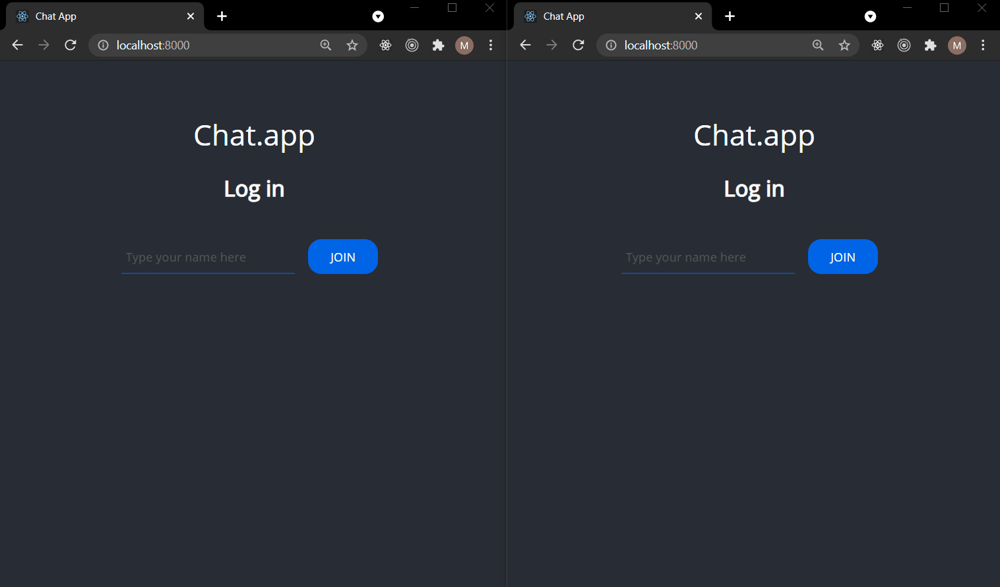

# CHAT APP WITH WEBSOCKET

CHAT APP WITH WEBSOCKET is simple full stack application creating with vanilla JS on frondend and Express with Websocket on backend. The application is used for sending and receiving messages from client to client immediately. More than two clients may participate in the conversation.

## How it works

## Getting Started
1. git clone git@github.com:Webster2020/CHAT_APP_WITH_WEBSOCKET.git
2. yarn install
3. yarn start - run the project and than You can see it on Your device

## Used technologies:
 1. HTML5 for content
 2. CSS for styling
 3. Vanilla JS for logic
 4. Express with Websocket for Backend

## Project architecture
 1. Frontend in 'client' catalog
  - content in index.html
  - styles in style.css
  - logic and connection with backend in app.js
 2. Backend
  - all logic for backend in server.js
 3. .gitignore with instruction to ignore files during commiting and pushing to remote repository
 4. package.json with scripts and installed packages

## How did I create this project?
Project was created during the course for training skills in Express and Webcosket.

## Authors

* **Michal Szwajgier** - *Webster2020* - 

## License
Free licence